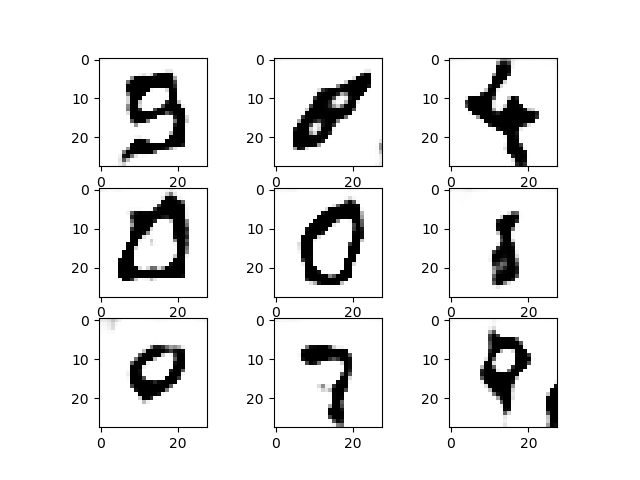

# tf-tutorial-GAN

## GAN for MNIST

嘗試使用GAN來生成手寫數字圖片, 使用的最基本的MNIST資料集

參考了[教電腦畫畫：初心者的生成式對抗網路(GAN)入門筆記](https://medium.com/@gau820827/%E6%95%99%E9%9B%BB%E8%85%A6%E7%95%AB%E7%95%AB-%E5%88%9D%E5%BF%83%E8%80%85%E7%9A%84%E7%94%9F%E6%88%90%E5%BC%8F%E5%B0%8D%E6%8A%97%E7%B6%B2%E8%B7%AF-gan-%E5%85%A5%E9%96%80%E7%AD%86%E8%A8%98-tensorflow-python3-dfad71662952) 這篇文章,而裡面的code則是來自[這個repo](https://github.com/jonbruner/generative-adversarial-networks)

因為是處理圖片, GAN的 Discriminator(Dis) 和 Generator(Gen) 都是用CNN架構實作
但原始的code有個地方被我做了修改

### Generator Model

原本的 Gen 是將輸入的 random vector 化成 56x56 的matrix, 然後再通過幾層CNN最後生成 28x28 的圖片

但我其實不太確定為何要這樣做, 所以改用比較常見的 deconvolution CNN 讓小的matrix慢慢還原成 28x28 的圖片

我的 Gen 的其中一層:

	// deconvolution layer
    g_w2 = tf.get_variable('g_w2', [5, 5, 32, 64], dtype=tf.float32, initializer=tf.truncated_normal_initializer(stddev=0.02))
	g_b2 = tf.get_variable('g_b2', [32], initializer=tf.truncated_normal_initializer(stddev=0.02))
	g2 = tf.nn.conv2d_transpose(g1, g_w2, [b_size, 14, 14, 32], strides=[1, 2, 2, 1], padding='SAME')
	g2 = g2 + g_b2
	g2 = tf.contrib.layers.batch_norm(g2, epsilon=1e-5, scope='bn2')
	g2 = tf.nn.relu(g2)

從生成的圖片來看, 感覺效果有比較好一些

另外, 因為 Dis 有pre-train過, 我發現如果在 GAN 中直接輪流訓練會使 Dis 太強勢, 而 Gen 訓練不太起來, 所以我會訓練一次 Dis 之後訓練兩次 Gen, 兩邊會比較平衡, loss不會差太多

### Generator Progress

以下是一些 Gen 隨機生成的圖片:

- iter = 0 : 還沒train過的隨機亂塗  

- iter 1000 : 學到數字會寫在中間,邊界會是白的,但中間還是一團黑  

- iter 2000 : 學到中間不會是一團黑,有一些簡單線條或圓圈出現  

- iter 4000 : 開始出現少數能認出來的數字,像右上的9和左下的7

- iter 7000 ~ 8000 : 會出現0~9各種不同的數字,列幾個比較好的生成結果  

我只train到10000 iter  
而後面生成的圖片沒有太明顯進步所以就不貼了
